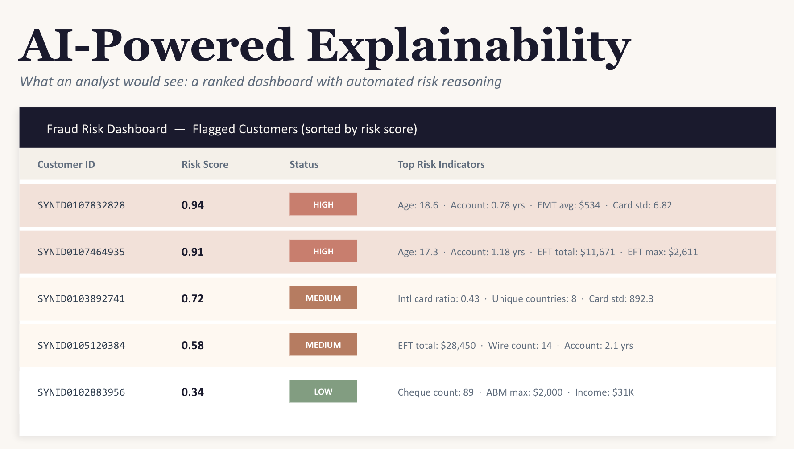

# 🛡️ Bank Fraud Detection: Predictive Analytics & Product Strategy

**IMI Big Data and AI Competition (Sept 2025 - Feb 2026)**

This repository contains the data analysis pipeline, machine learning models, and strategic presentation developed for the IMI Big Data and AI Competition. The core objective was to build a robust detection model that minimizes financial loss while maintaining a frictionless user experience for legitimate customers.

*Note: Due to data privacy and competition confidentiality, the original dataset of 61,000+ records has been removed. A `mock_data.zip` archive has been provided to demonstrate the schema and pipeline functionality without compromising proprietary information.*

## 📈 Business Impact & Results

Fraud detection isn't just about catching bad actors; it's about reducing false positives that alienate good customers. By moving beyond basic rule-based systems, this project delivered:

* **22% Optimization in Fraud Detection:** Successfully applied supervised learning and statistical analysis to drastically improve detection rates over the baseline model.
* **Actionable Stakeholder Dashboards:** Translated complex model outputs into clear visual dashboards to drive strategic decision-making and product strategy for non-technical stakeholders.

## 🧠 The Data Strategy

The project required a full-stack data science approach, focusing on translating analytical findings into business value.

* **Data Engineering:** Cleaned, transformed, and engineered features from a massive, multi-table transactional dataset.
* **Predictive Modeling:** Implemented and tuned supervised machine learning models to identify high-risk transaction patterns.
* **Data Visualization & Strategy:** Built comprehensive dashboards to visualize risk distribution, ensuring the technical findings directly informed business strategy.

## 📂 Repository Contents

* `IMI_Fraud_Detection_Pipeline.ipynb`: The complete Python data analysis and machine learning pipeline (configured to run with the provided mock data).
* `IMI_Fraud_Detection_Deck.pdf`: The strategic presentation deck outlining the business case, methodology, and final product recommendations.
* `mock_data.zip`: A synthetic dataset illustrating the data schema required to run the pipeline.
